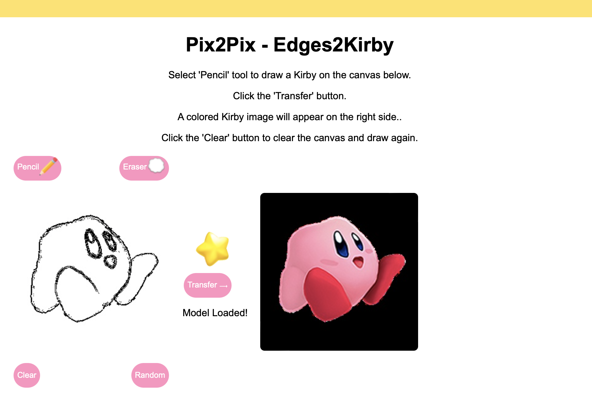

# pix2pix in tensorflow.js



Try it yourself: Download/clone the repository and run it locally:
```bash
git clone https://github.com/melissarimsza/Edges2Kirby.git
cd Edges2Kirby
python3 -m http.server
```

## How we did it
- 1. Prepare the data
- 2. Train the model
- 3. Test the model
- 4. Export the model
- 5. Port the model to tensorflow.js
- 6. Create an interactive interface in the browser


Credits: This project is based on [yining1023](https://github.com/yining1023)'s [pix2pix-tensorflow](https://github.com/yining1023/pix2pix_tensorflowjs.git). 
